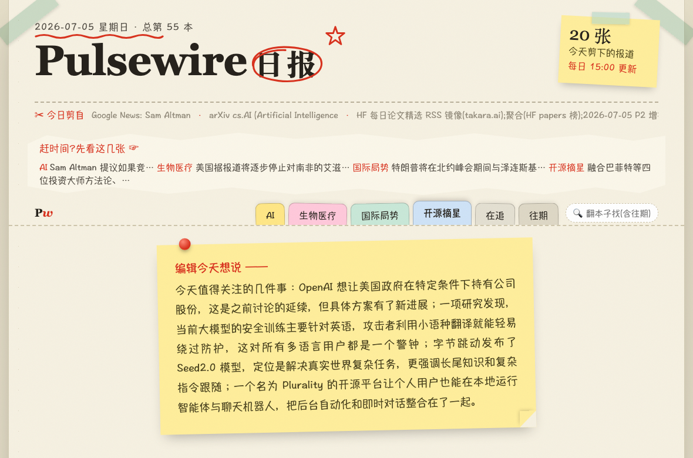
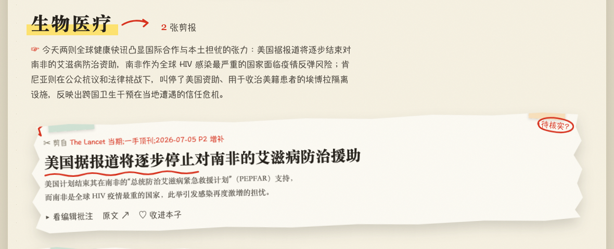
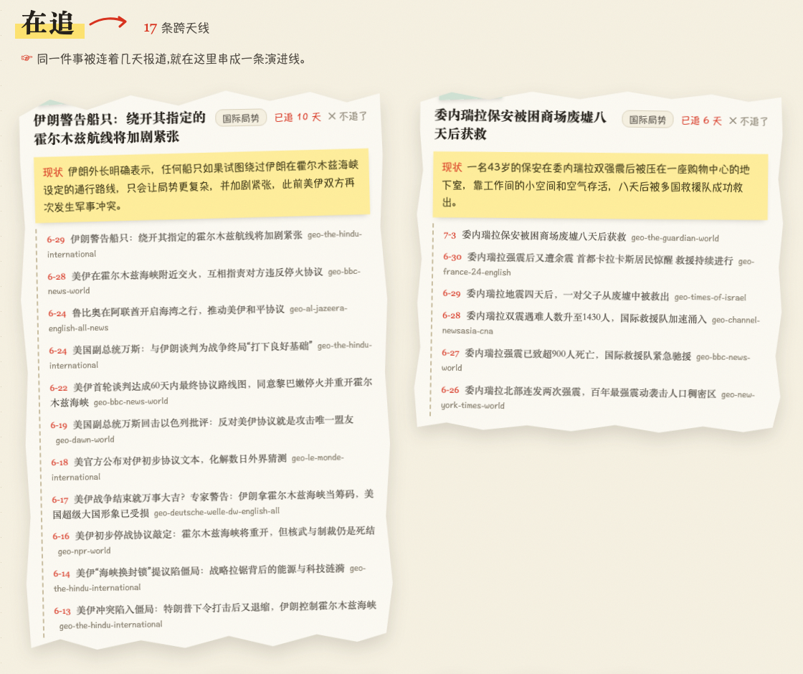

<p align="center"></p>

<p align="center">
  <a href="https://github.com/birdindasky/pulsewire/actions/workflows/ci.yml"></a>
  
  
  
  <a href="README.md"></a>
</p>

**pulsewire is a news intelligence engine that runs entirely on your own Mac.** Every day it pulls from **331 registered sources** (323 currently enabled: journals, lab blogs, major outlets, communities, GitHub) across AI / biotech / geopolitics / open source, clusters them into *events*, runs them through a panel of LLM judges, verifies every number against its source, and delivers a scrapbook-style daily digest — as a web page, a macOS desktop app, and (optionally) a Feishu push.

Three principles are welded into the architecture:

- **Scarcity over filler** — fluff, off-topic and not-newsworthy items go to the wastebasket. A thin news day produces a thin issue, never a padded one.
- **Zero fabricated numbers** — the LLM never sees numbers, only placeholders. The system fills real values back in from the source; anything untraceable gets a visible "unverified" stamp.
- **No reruns** — a story covered on previous days gets a red "Day N of coverage" stamp and only the *new* developments are written; the full timeline lives in the tracking view.

> **Note:** the digest output is written in **Chinese** — global sources in, plain-Chinese daily briefing out. That's the product. The codebase, config and docs are navigable for non-Chinese speakers, but the daily issue itself is Chinese.

## What it looks like

A daily issue with masthead, editor's note, and index tabs — all functional:



Ongoing stories get a red tracking stamp; copy covers only the increment:


Shaky single-source claims are circled honestly:



The tracking view chains multi-day coverage into one evolving thread:



## How it differs from an RSS reader

| | RSS reader | pulsewire |
|---|---|---|
| Unit | articles | **events** (multi-source reports clustered; one card per event) |
| Ranking | reverse-chron | **heat** (count of credible sources × acceleration) + hard freshness window |
| Quality control | none | **majority-vote LLM judge panel**: board classifier → topic gate → magnitude gate → worthiness gate |
| Numbers | whatever the article says | **source-verified**: the model can't invent numbers; untraceable ones are flagged |
| Duplicates | daily déjà vu | **clip memory**: already-covered stories are cut; sagas continue incrementally |
| Archive | unsearchable | **semantic Q&A**: `pulsewire ask "..."` answers only from archived cards, with citations, or says "not found" |

## Pipeline

```mermaid
flowchart LR
  A["fetch<br>323 sources"] --> B["dedup<br>local embeddings"] --> C["enrich<br>traceable facts"]
  C --> D["events<br>cluster + heat rank"] --> E["judge panel<br>board/topic/magnitude/worthiness"]
  E --> F["summarize<br>numbers as placeholders"] --> G["verify<br>fill from source"]
  G --> H["threads<br>multi-day linking"] --> I["render<br>scrapbook PNG"] --> J["deliver<br>web/desktop/Feishu"]
```



A single async Python process plus one postgres (pgvector) container. Every stage checkpoints; failures alert and resume — it never silently ships an empty issue. See [`docs/ARCHITECTURE.md`](docs/ARCHITECTURE.md) (architecture) and [`docs/DESIGN.md`](docs/DESIGN.md) (design rationale) — both in Chinese.

## Getting started (macOS)

Prereqs: Apple Silicon Mac · [Docker Desktop](https://www.docker.com/products/docker-desktop/) · [uv](https://docs.astral.sh/uv/) · a [DeepSeek API key](https://platform.deepseek.com/) (heavy daily use ≈ ¥2 ≈ $0.28/day).

```bash
git clone https://github.com/birdindasky/pulsewire.git && cd pulsewire
cp .env.example .env            # set PULSEWIRE_DEEPSEEK_API_KEY
docker compose up -d postgres
uv run alembic upgrade head
uv run pulsewire run --force    # full pipeline, ~20–35 min
open web/app/index.html
```

- **Daily schedule**: `uv run pulsewire schedule --hour=6` generates launchd files and prints install instructions (auto-starts Docker, shuts it down after, catches up after wake).
- **Desktop app**: `cd desktop && npm install && npm start`.
- **Ask the archive**: `uv run pulsewire ask "any progress on fusion?"`
- Boards, quotas and every judge gate live in `config.yaml` with inline comments and one-line rollbacks; the source registry is [`sources.yaml`](sources.yaml).

## Honest edges

- **Built for macOS (Apple Silicon)**: embeddings run on MLX/Metal, scheduling uses launchd. Linux runs the core pipeline (CI runs the full test suite on Ubuntu) but needs an embedding provider swap and your own cron.
- **Output is Chinese** — by design.
- **Bring your own DeepSeek key** (litellm-compatible; swapping providers is a one-line config change).
- **Feishu push is optional**; web + desktop work without it.
- **Single-player**: no accounts, no server, no subscription. Clone it, run yours.

## License

[MIT](LICENSE) © birdindasky
