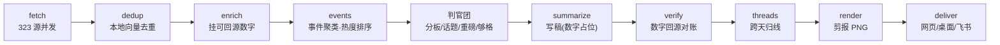

<p align="center"></p>

<p align="center">
  <a href="https://github.com/birdindasky/pulsewire/actions/workflows/ci.yml"></a>
  
  
  
  <a href="README.en.md"></a>
</p>

**pulsewire 是一台跑在你自己 Mac 上的新闻情报引擎。** 每天从 **331 个注册信源**(当前启用 323:顶刊、实验室官网、大报、社区、GitHub)抓取 AI / 生物医疗 / 国际局势 / 开源动态,经过事件聚类、LLM 判官团层层质检、数字回源对账,在固定时间产出一本**剪报本日报**——网页版 + macOS 桌面 App + 飞书推送(可选)。

三条底线,焊死在架构里:

- **宁缺毋滥**——水货、跑题、不够格的,一律进纸篓;没有大事就少报,绝不硬凑版面。
- **数字 0 编造**——模型从头到尾见不到数字,只见占位符;每个数字由系统对照原文回填,追不回来源的标「待核实」。
- **不复读**——同一件事连着几天报,盖「追 · 第N天」章、只写新进展;前情去「在追」页看演进线。

## 长什么样

每天一本,报头、编者按、导读、索引标签,全是可点的真功能:


连续追踪的事件盖上红章,写稿只写增量:


拿不准的断言,老老实实圈出来:


「在追」页把同一件事的多天报道串成演进线:


落款连当天扔掉了什么都告诉你:


## 它和 RSS 阅读器有什么不一样

| | RSS 阅读器 | pulsewire |
|---|---|---|
| 单位 | 一条条文章 | **一个个事件**(多源报道聚成一件事,一事一卡) |
| 排序 | 时间倒序 | **热度**(多少家可信源在报 × 加速度)+ 新鲜度硬窗 |
| 质检 | 无 | **LLM 判官团多数票**:分板 → 话题闸 → 重磅度闸 → 够格闸 |
| 数字 | 原文什么样就什么样 | **回源对账**:模型编不出数字,追不回的标「待核实」 |
| 重复 | 天天见 | **已剪记忆**:报过的不再报,连续剧只写新进展 |
| 历史 | 翻不动 | **语义问答**:`pulsewire ask "OpenAI 上市有什么进展?"`,每句答案标出处,查无此事就说没找到 |

## 流水线



单体异步 Python + 一个 postgres(pgvector)容器。每站写检查点,断电断网从断点续跑;任何一站失败都告警冒泡,**绝不静默产出空日报**。细节见 [`docs/ARCHITECTURE.md`](docs/ARCHITECTURE.md),每个设计为什么这么做见 [`docs/DESIGN.md`](docs/DESIGN.md)。

## 跑起来(macOS)

前置:Apple Silicon Mac · [Docker Desktop](https://www.docker.com/products/docker-desktop/) · [uv](https://docs.astral.sh/uv/) · 一把 [DeepSeek API key](https://platform.deepseek.com/)(重度使用约 ¥2/天)。

```bash
git clone https://github.com/birdindasky/pulsewire.git && cd pulsewire
cp .env.example .env            # 填 PULSEWIRE_DEEPSEEK_API_KEY
docker compose up -d postgres   # 数据库(pgvector)
uv run alembic upgrade head     # 建表
uv run pulsewire run --force    # 整跑一遍,约 20–35 分钟
open web/app/index.html         # 看你的第一本日报
```

- **每天自动跑**:`uv run pulsewire schedule --hour=6` 生成 launchd 调度文件并打印安装说明(自动拉起 Docker、跑完关掉、睡过点插电后自动补课)。
- **桌面 App**:`cd desktop && npm install && npm start`(打包装进 /Applications 见 [`desktop/README.md`](desktop/README.md))。
- **问历史**:`uv run pulsewire ask "最近核聚变有什么进展?"` ——只答档案里有的,每句标出处。
- 板块、限额、每道闸的开关都在 `config.yaml`,每个开关旁都有注释和一行回滚说明;信源注册表在 [`sources.yaml`](sources.yaml)(注册 331 源 / 启用 323,带权重/新鲜窗/抓取方式,本仓库最值钱的资产之一)。

## 成本

| 项 | 花费 |
|---|---|
| LLM(DeepSeek:判官团 + 写稿,服务端缓存命中 ~67%) | **约 ¥2 / 天** |
| 向量、渲染、存储 | ¥0(全本地:MLX 跑 Apple GPU) |
| 服务器 | ¥0(就是你自己的 Mac,睡了就睡了,插电自动补) |

## 丑话说在前面

- **为 macOS(Apple Silicon)而生**:语义去重跑 MLX/Metal,定时靠 launchd,桌面 App 是 Electron/mac。Linux 能跑核心流水线(CI 就在 Ubuntu 上跑全套测试),但嵌入要换 provider、调度自己配 cron,开箱体验是 Mac 的。
- **日报是中文的**:全球信源进,中文大白话出。这是特色,不是缺陷。
- **要自备 DeepSeek key**:接口走 litellm 通用制式,想换别家兼容模型改一行配置。
- **飞书推送是可选件**:不配飞书,网页版 + 桌面 App 照常满血。
- **单人份**:没有账号、订阅、服务器,谁 clone 谁跑自己的。

## 文档地图

| 文档 | 用途 |
|---|---|
| [`docs/ARCHITECTURE.md`](docs/ARCHITECTURE.md) | 系统当前真相:流水线 / 数据模型 / 数字回源 / 锁定决策 |
| [`docs/DESIGN.md`](docs/DESIGN.md) | 所有「为什么这么设计」合订本:选稿引擎 / 判官团 / 事件线 / 语义问答 |
| [`STYLE.md`](STYLE.md) | 剪报本视觉规范(改视觉先读这个) |
| [`desktop/README.md`](desktop/README.md) | 桌面 App 构建与安装 |

## License

[MIT](LICENSE) © birdindasky
